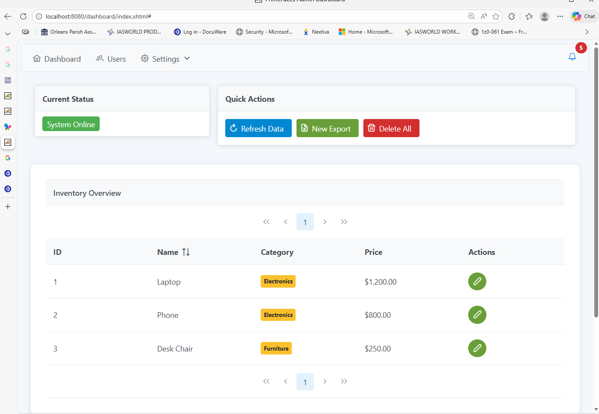

# 📊 Dashboard Project

## ✍️ Author
* **Joseph Adogeri** - *Lead Developer* - [JosephAdogeriDev](https://github.com)

---

Welcome to the **Dashboard** project! This is a modern web application built with **Jakarta EE 11** and **JSF (Jakarta Faces) 4.1**, designed for high-performance data visualization and management.


 

## 🛠 Project Requirements

To build and run this project, ensure your environment matches the specifications defined in the `pom.xml`:


| Component | Required Version | Source in your POM |
| :--- | :--- | :--- |
| **JDK (Java)** | **17** | `maven.compiler.source` |
| **Maven** | **3.8+** (3.9.x rec.) | Industry standard for EE 11 |
| **Faces (JSF)** | **4.1** | `jakarta.faces` dependency |
| **Server** | **Tomcat 11** | `jakartaee-api` 11.0.0 |

---

## 💻 IDE Configuration (Eclipse)

This project is optimized for **Eclipse IDE for Enterprise Java and Web Developers**.

1.  **Java Compliance:** Ensure [Eclipse is configured to use JDK 17](https://help.eclipse.org) under `Window > Preferences > Java > Installed JREs`.
2.  **Project Facets:** Right-click the project → `Properties` → `Project Facets`. Ensure **Java 17** and **Jakarta Faces 4.1** are selected.
3.  **Maven Integration:** Right-click the project → `Maven` → `Update Project (Alt+F5)` to sync dependencies.

---

## 📥 Installation

1.  **Clone the repository:**
    ```bash
    git clone https://github.com/dashboard.git
    ```
2.  **Import into Eclipse:**
    *   Go to `File > Import... > Maven > Existing Maven Projects`.
    *   Browse to the directory where you cloned the repository.
3.  **Build the Project:**
    ```bash
    mvn clean install
    ```

---

## 🚀 Usage

1.  **Configure Server:** Download and configure [Apache Tomcat 11](https://tomcat.apache.org) within the Eclipse `Servers` view.
2.  **Deploy:** Right-click the `dashboard` project → `Run As` → `Run on Server`.
3.  **Access:** Open your browser and navigate to:
    `http://localhost:8080/dashboard`

---

## 📦 Key Dependencies

*   **PrimeFaces 14.0.0:** High-quality UI components for JSF (Jakarta classifier).
*   **Weld 6.0.2:** CDI implementation for Jakarta EE.
*   **JasperReports 6.21.3:** For generating complex data reports.

---

## 🤝 Acknowledgements

*   The [PrimeFaces Community](https://www.primefaces.org) for the excellent UI library.
*   The [Jakarta EE Working Group](https://jakarta.ee) for the modern cloud-native standards.
*   The [Apache Maven Project](https://maven.apache.org) for build automation.
